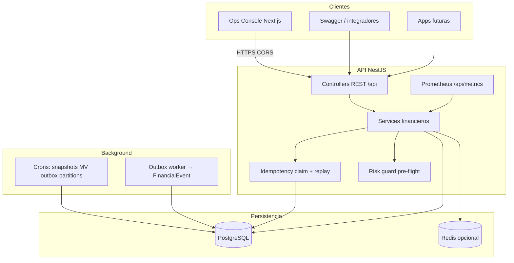
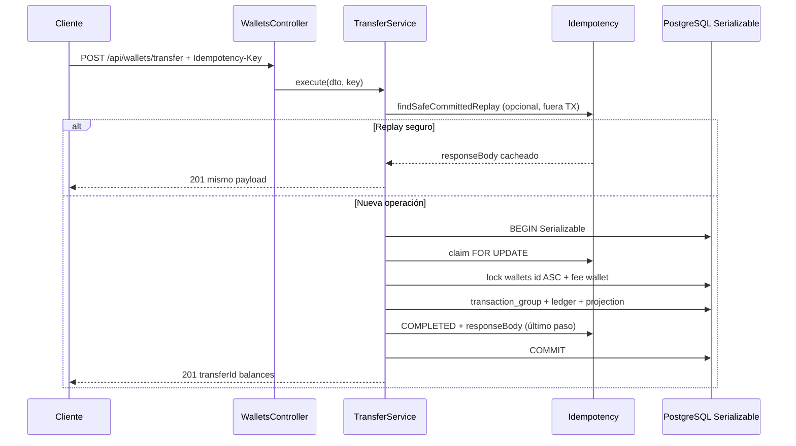

# Arquitectura — Wallet Ledger Service

Documento de diseño para entender el sistema **sin leer el código**. Complementa el detalle financiero en [financial-design.md](./financial-design.md) y la estrategia de pruebas en [tests-risks.md](../tests-risks.md).

---

## 1. Diagrama de arquitectura

### 1.1 Vista de componentes



### 1.2 Flujo de una operación de escritura (transfer)



### 1.3 Capas del monolito

| Capa | Ubicación | Responsabilidad |
|------|-----------|-----------------|
| HTTP | `src/modules/*/controllers` | Validación DTO, headers, Swagger |
| Dominio financiero | `deposit/transfer/withdraw.service` | TX Serializable, ledger, fees |
| Infraestructura | `prisma`, `redis`, `lock-order` | Persistencia, reintentos |
| Lectura / ops | `reconciliation`, `reporting`, `audit` | Sin mutar balances |
| Inteligencia | `risk`, `anomaly`, `events`, `monitoring` | Guards y observabilidad |

**Fuente de verdad del dinero:** tabla `ledger_entries` (append-only).  
**Proyección de lectura rápida:** `wallets.currentBalance` (actualizada en la misma TX que el ledger).

---

## 2. Contrato de interfaz

### 2.1 Elección: REST síncrono (HTTP/JSON)

| Opción | Por qué no (aquí) | Por qué sí REST |
|--------|-------------------|-----------------|
| **gRPC** | Requiere codegen y proxies; el examen y el ops-console consumen HTTP | Swagger + curl + Vercel sin stub |
| **Eventos solo (async)** | El cliente necesita saber **ahora** si el retiro se aplicó o falló por fondos | POST → 201/422 inmediato; outbox es *adicional* |
| **GraphQL** | Mutaciones financieras + idempotency por header es más claro en REST | Un recurso = una operación con semántica HTTP |

**Eventos:** existen (`financial_events`, outbox) para auditoría y futuros consumidores, pero **no sustituyen** la respuesta HTTP de la operación.

**Prefijo global:** `/api` (health, wallets, reconciliation, reporting, metrics, etc.).

### 2.2 Orden de invocación recomendado (cliente)

```text
1. POST /api/wallets                          → walletId (sin idempotency)
2. POST /api/wallets/:id/deposit            → Idempotency-Key obligatorio
3. POST /api/wallets/transfer               → Idempotency-Key obligatorio
4. POST /api/wallets/:id/withdraw           → Idempotency-Key obligatorio
5. GET  /api/wallets/:id                    → consulta saldo (opcional entre pasos)
6. GET  /api/reconciliation/wallets/:id     → verificar consistencia (ops)
```

Las lecturas (`GET`) no requieren idempotency. Las escrituras monetarias **siempre** llevan header `Idempotency-Key` (UUID recomendado).

### 2.3 Operaciones de escritura — payloads y respuestas

Todas las respuestas exitosas usen envoltorio `{ data: ... }` (interceptor global).

#### Crear wallet

```http
POST /api/wallets
Content-Type: application/json

{ "currency": "USD" }
```

→ `201` — `{ data: { id, currency, currentBalance: "0.00", status, version } }`

#### Depósito

```http
POST /api/wallets/:walletId/deposit
Idempotency-Key: <uuid-único-por-intento-lógico>
Content-Type: application/json

{ "amount": 100.00 }
```

→ `201` — `{ data: { depositId, transactionGroupId, balanceAfter, ... } }`

Scope idempotency interno: `default`.

#### Transferencia

```http
POST /api/wallets/transfer
Idempotency-Key: <uuid>
Content-Type: application/json

{
  "fromWalletId": "<uuid>",
  "toWalletId": "<uuid>",
  "amount": 30.00
}
```

→ `201` — fee 0.5% sobre `amount`; débito total = amount + fee.  
Scope: `wallet.transfer`.

#### Retiro

```http
POST /api/wallets/:walletId/withdraw
Idempotency-Key: <uuid>
Content-Type: application/json

{ "amount": 20.00 }
```

→ `201` — fee 1% sobre `amount`. Scope: `wallet.withdraw`.

#### Consulta (sin idempotency)

```http
GET /api/wallets/:id
GET /api/wallets/:id/movements?limit=50&cursor=<opcional>
```

### 2.4 Errores — catálogo para el consumidor

Cuerpo típico (`DomainException` / filter global):

```json
{
  "statusCode": 409,
  "code": "IDEMPOTENCY_CONFLICT",
  "message": "...",
  "correlationId": "..."
}
```

| HTTP | code | Cuándo | Qué debe hacer el cliente |
|------|------|--------|---------------------------|
| 400 | `IDEMPOTENCY_KEY_REQUIRED` | Falta header en deposit/transfer/withdraw | Enviar `Idempotency-Key` |
| 404 | `WALLET_NOT_FOUND` | UUID inválido o wallet borrada | No reintentar igual |
| 422 | `INSUFFICIENT_FUNDS` | balance < amount + fee | No reintentar sin cambiar monto |
| 422 | `INVALID_AMOUNT` | amount ≤ 0 o formato | Corregir payload |
| 409 | `IDEMPOTENCY_CONFLICT` | Misma key, otra petición en vuelo | Esperar y reintentar GET o mismo POST con **misma** key |
| 409 | `IDEMPOTENCY_PAYLOAD_MISMATCH` | Misma key, body distinto | Nueva key o corregir error humano |
| 409 | `CONCURRENCY_CONFLICT` | Optimistic version / lock | Reintentar con **misma** idempotency key |
| 409 | `SERIALIZATION_FAILURE` | Postgres 40001 (Serializable) | Reintentar con backoff, **misma** key |
| 403 | `WALLET_RISK_BLOCKED` | Risk LIMITED/BLOCKED | No operar hasta revisión |
| 503 | `CIRCUIT_BREAKER_OPEN` | Circuito abierto en dependencia | Backoff, alertar ops |
| 429 | (Throttler) | >10 req/min por IP (prod default) | Backoff; no confundir con fallo financiero |
| 503 | health | DB caída en `/api/health` | Load balancer quita instancia |

**Regla de oro:** para deposit/transfer/withdraw, un reintento tras timeout de red debe usar la **misma** `Idempotency-Key` hasta recibir `201` o un 422 de negocio definitivo.

Contrato OpenAPI completo: `/api/docs` (Swagger).

---

## 3. Modelado de datos

### 3.1 Motor: PostgreSQL único (relacional)

| Decisión | Razón | Alternativa descartada |
|----------|-------|------------------------|
| **SQL (Postgres)** | ACID, `Serializable`, `FOR UPDATE`, CHECK constraints | MongoDB: sin TX multi-documento fuerte para ledger doble entrada |
| **Un solo primario** | Orden global de locks por `walletId` lexicográfico | CQRS con dos DBs: complejidad operativa para MVP |
| **Ledger append-only** | Auditoría regulatoria; reconstrucción | UPDATE de saldo sin historial: imposible auditar |

Redis: disponible (`RedisModule`) para caches futuros; **no** es fuente de verdad del balance.

### 3.2 Entidades principales

```text
Wallet (proyección)
  └── LedgerEntry[] (verdad, particionada por createdAt)

TransactionGroup (operación lógica 1:N asientos)
  └── LedgerEntry[]
  └── IdempotencyKey? (1:1 cuando completada)

IdempotencyKey (scope + key único)
FinancialEvent / FinancialEventOutbox (inteligencia async)
FinancialSnapshot, mv_daily_* (reporting)
```

### 3.3 Índices defendidos

| Tabla / índice | Propósito |
|----------------|-----------|
| `idempotency_keys @@unique([scope, key])` | Un intento lógico por scope; base de idempotencia |
| `idempotency_keys @@index([status])` | Limpiar/expirar PROCESSING huérfanos (ops) |
| `ledger_entries @@index([walletId, createdAt])` | Movimientos paginados + MV incremental |
| `ledger_entries @@index([operationType, createdAt])` | P&L y agregados por tipo |
| `ledger_entries PK (id, createdAt)` | Particionamiento por rango de fechas |
| `transaction_groups @@index([correlationId])` | Trazas de negocio |
| `financial_event_outbox @@index([status, nextRetryAt])` | Worker de reintentos |
| `wallets @@index([kind])` + único parcial SYSTEM_FEE/currency (SQL migración) | Una wallet de fees por moneda |

**Constraints en DB (no solo app):**

- `wallets.currentBalance >= 0`
- `ledger_entries.amount > 0` (signo vía `operationType`)
- `UNIQUE (transactionGroupId, operationType, walletId)` en asientos con grupo

Detalle de invariantes y flujos TX: [financial-design.md](./financial-design.md).

---

## 4. Garantías y consistencia (4 escenarios)

Lo que **prometemos al consumidor** del API, no solo lo interno.

### Escenario A — Dos solicitudes paralelas del mismo usuario

**Situación:** dos tabs o dos dispositivos envían transfer/withdraw casi a la vez (keys distintas).

**Promesa:**

- No habrá saldo negativo (CHECK + validación pre-commit).
- Cada operación con key distinta se serializa vía `Serializable` + locks `FOR UPDATE` en wallets ordenadas por UUID.
- Una puede recibir `409 CONCURRENCY_CONFLICT` o `SERIALIZATION_FAILURE` → el cliente **reintenta con su propia key** (no la de la otra petición).

**No prometemos:** orden FIFO visible entre operaciones independientes; solo atomicidad por operación.

**Prueba:** `test/e2e/concurrency-caso-b.spec.ts`.

---

### Escenario B — El cliente reintenta porque no recibió respuesta (idempotencia)

**Situación:** timeout HTTP después de que el servidor hizo COMMIT, o el usuario pulsa “reintentar”.

**Promesa:**

- Misma `Idempotency-Key` + mismo body → **como máximo un** efecto en ledger; respuestas `201` con el mismo `transactionGroupId` / ids de operación.
- Misma key + body distinto → `409 IDEMPOTENCY_PAYLOAD_MISMATCH` (no se aplica el segundo payload).
- Key en vuelo (`PROCESSING`) → `409 IDEMPOTENCY_CONFLICT` hasta completar; luego replay.

**Mecanismo:** claim en TX + `responseBody` escrito en el último paso del COMMIT (ver financial-design).

**Prueba:** `duplicate-withdraw-same-key.spec.ts`, `concurrency-caso-a.spec.ts`.

---

### Escenario C — El proceso se reinicia a mitad de una transferencia

**Situación:** SIGKILL / deploy Railway durante TX.

**Promesa:**

- Si no hubo COMMIT: no hay asientos definitivos; idempotency `PROCESSING` hace rollback con la TX → el cliente puede reintentar con la **misma** key.
- Si hubo COMMIT: idempotency `COMPLETED` + grupo `COMPLETED` + ledger; reintento = replay HTTP 201 idéntico (fast path o claim dentro de TX).
- **No** quedará transfer “a medias” (solo OUT sin IN): todo el grupo es una sola TX Serializable.

**No prometemos:** entrega del evento outbox si el crash fue después del COMMIT pero antes del worker; eso es consistencia **eventual** (outbox reintenta).

---

### Escenario D — La base de datos falla por un instante

**Situación:** Postgres reinicio, failover, conexión cortada.

**Promesa:**

- Durante indisponibilidad: `GET /api/health` → `503`; operaciones financieras fallan (5xx) sin COMMIT parcial visible.
- Tras recuperación: reintentos con **misma** idempotency key son seguros (Escenario B).
- Errores `40001` (serialización): reintentos automáticos en servidor (hasta 5 con jitter); el cliente puede ver `409 SERIALIZATION_FAILURE` y reintentar.

**No prometemos:** disponibilidad 100% sin load balancer multi-instancia; hoy es despliegue típico single-primary en Railway.

---

## 5. Trade-offs y alternativas

| Decisión | Razón | Alternativa descartada |
|----------|-------|------------------------|
| TX `Serializable` | Evita anomalías de lectura en balances | `Read Committed`: riesgo de write skew bajo concurrencia |
| Proyección `currentBalance` | Lecturas O(1) en GET | Solo SUM(ledger): correcto pero lento en cada consulta |
| Idempotency en Postgres | Mismo COMMIT que ledger | Redis SETNX: segundo sistema de verdad, split-brain |
| Fast path replay fuera de TX | Latencia en reintentos | Solo fast path: inseguro si DB manual corrupta |
| Fees en misma TX que operación | Revenue atómico con transfer/withdraw | Fee async: riesgo de operación sin fee cobrado |
| Reconciliación read-only | Ops humano antes de reparar | Auto-repair silencioso: puede ocultar fraude o bugs |
| Throttle 10 req/min (prod) | Protección básica abuse | Sin throttle: stress demo rompe prod (visto en ops-console) |
| Particiones ledger por fecha | Escaneos acotados en reporting | Tabla monolítica: degradación con millones de filas |
| Outbox + DLQ | Eventos no pierden intentos | Fire-and-forget en memoria: pérdida en crash |
| Risk guard en transfer/withdraw | Abuso / velocity | Solo post-facto anomaly: dinero ya movido |
| Ops Console separado (Next.js) | Demo y stress sin tocar API | Todo en Swagger: peor UX para evaluación |

---

## 6. Scope — lo que queda fuera (y por qué)

| Fuera de scope | Motivo |
|----------------|--------|
| Autenticación / autorización (OAuth, API keys por tenant) | Enfoque en ledger; CORS solo para demo |
| Multi-moneda con FX | Solo `currency` en wallet; sin tipos de cambio |
| Compensación automática de drift | Solo detección; reparación manual |
| Sharding / multi-región | Locks lexicográficos locales; ver financial-design |
| Retiros a red bancaria real | API simula cash-out interno |
| KYC / AML completo | Risk score heurístico, no compliance regulatorio |
| Sagas distribuidas entre servicios | Monolito modular, una DB |
| Cola de mensajes externa (Kafka) | Outbox en Postgres suficiente para MVP |
| Webhooks garantizados al cliente | Eventos internos + DLQ; integrador usa polling/reconciliation |

**Entregado además del MVP (opcionales):** ver lista numerada en [README.md](../README.md#elementos-opcionales-entregados).

---

## 7. Análisis de fallos en producción

| Qué creemos que se rompe primero | Síntoma | Mitigación |
|----------------------------------|---------|------------|
| **Throttle 10 req/min** | 429 en stress demo / scripts paralelos | Subir límite por env; `E2E_THROTTLE_LIMIT` en tests |
| **Retry storm Serializable** | Latencia p99, muchos 409 `SERIALIZATION_FAILURE` | Jitter + tope de reintentos; reducir paralelismo cliente |
| **Conexiones DB agotadas** | 503, health fail | Pool Prisma, escalar Railway, crons desactivables (`E2E_DISABLE_CRONS`) |
| **Drift proyección vs ledger** | `isConsistent: false` en GET/reconciliation | Alertar; investigar con `/api/reporting/audit/.../rebuild` |
| **Idempotency FAILED legítimo** | 409 tras error de negocio previo | Nueva key solo si el negocio lo permite; no reutilizar key fallida |
| **Outbox atascado → DLQ** | Eventos no en stream | Revisar `financial_event_dlq`; replay manual |
| **Partición ledger faltante** | INSERT falla en mes nuevo | Cron `LedgerPartitionCron` + registry |
| **Redis caído** | Degradación si se usa cache futuro | Hoy: operaciones core no dependen de Redis |
| **Deploy mid-TX** | Cliente sin respuesta | Reintento idempotente (Escenario B/C) |
| **CORS mal configurado** | Front Vercel bloqueado | `CORS_ORIGINS` en Railway |

---

## 8. Operación

### 8.1 Levantar el sistema

| Entorno | Comando / acción |
|---------|------------------|
| Local todo-en-uno | `npm run docker:stack` (Postgres + Redis + API + migrate) |
| Local dev API | `npm run docker:up` + `prisma migrate dev` + `start:dev` |
| Producción Railway | Pre-deploy: `prisma migrate deploy` · Start: `npm run start` |
| Health probe | `GET /api/health` (503 si DB down) |

### 8.2 Monitoreo

| Recurso | URL / mecanismo |
|---------|-----------------|
| Métricas Prometheus | `GET /api/metrics` |
| Panel live | `GET /api/monitoring/live` |
| Logs | Pino JSON (`serialization.retry`, `reconciliation.drift_detected`) |
| Swagger | `/api/docs` |
| Reconciliación | `GET /api/reconciliation/drift` |

**Métricas clave (Prometheus):**

- `financial_operation_total{operation,status}`
- `idempotency_replay_total`, `idempotency_conflict_total`
- `reconciliation_drift_total{severity}`
- `http_request_duration_seconds`
- `circuit_breaker_open_total`, `dlq_events_total`, `outbox_dispatch_total`

### 8.3 Debug de un incidente (runbook corto)

1. **¿El API responde?** `GET /api/health` + revisar deploy Railway (`RAILWAY_GIT_COMMIT_SHA` en health).
2. **¿Un wallet reporta inconsistencia?** `GET /api/reconciliation/wallets/:id` → `difference`, severidad.
3. **¿Doble cargo sospechado?** Buscar `Idempotency-Key` en DB; comparar `ledger_entries` por `transactionGroupId`.
4. **¿Muchos 429?** Throttler — no es bug financiero.
5. **¿Muchos 409 SERIALIZATION?** Carga concurrente — revisar logs `serialization.retry`.
6. **¿P&L no cuadra?** `GET /api/reporting/pnl` vs suma `FEE_IN` en ledger; snapshots `financial_snapshots`.

### 8.4 Alertas sugeridas

| Alerta | Condición | Severidad |
|--------|-----------|-----------|
| API down | health != 200 > 2 min | P1 |
| Drift detectado | `reconciliation_drift_total` o drift endpoint > 0 | P1 |
| DLQ creciendo | `dlq_events_total` rate > 0 sostenido | P2 |
| Circuit abierto | `circuit_breaker_open_total` | P2 |
| Error rate financiero | `financial_operation_total{status="failure"}` / success > 5% | P2 |
| Latencia p99 | `http_request_duration_seconds` p99 > 2s | P3 |
| Idempotency conflicts spike | `idempotency_conflict_total` anómalo | P3 (puede ser cliente mal integrado) |

---

## 9. Referencias cruzadas

| Tema | Documento |
|------|-----------|
| Invariantes y pasos TX | [financial-design.md](./financial-design.md) |
| Riesgos ↔ tests | [tests-risks.md](../tests-risks.md) |
| Cómo ejecutar tests | [tests.md](../tests.md) |
| Inicio rápido | [README.md](../README.md) |
